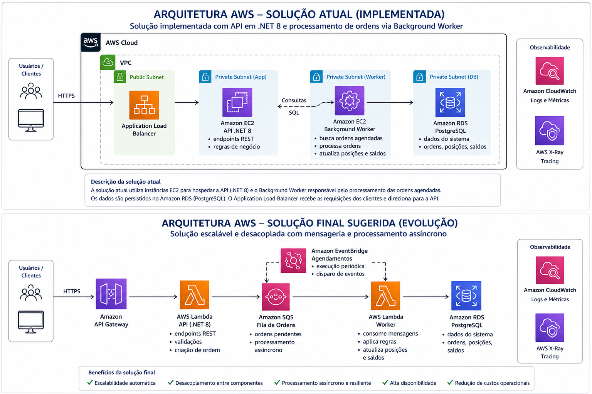
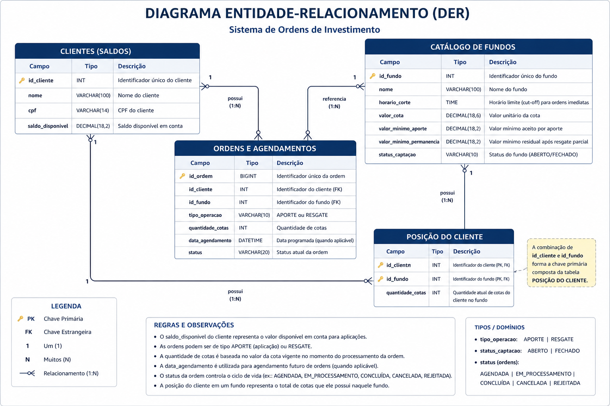
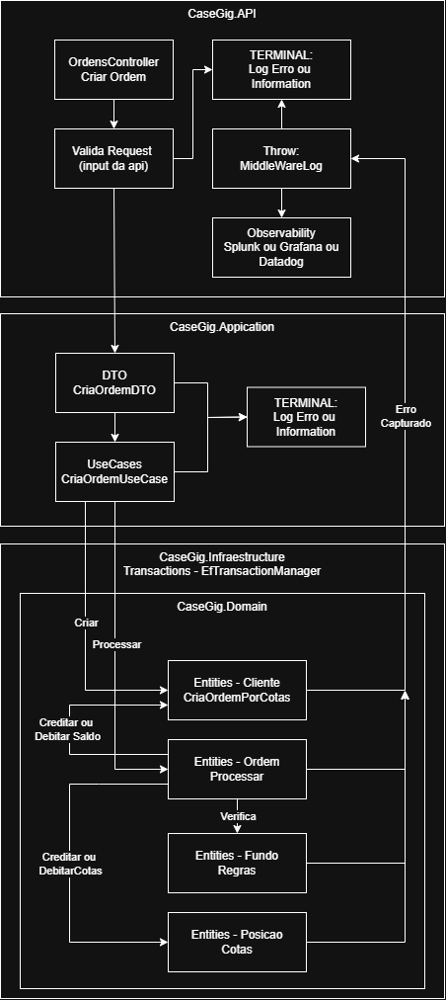

# Sistema de Ordens de Investimento (Aporte/Resgate)

API REST para criação e processamento de ordens de investimento em fundos, com:

- Validação de regras de negócio (saldo, posição, mínimos, fundo ABERTO/FECHADO)
- Regra de cut-off por fundo (ordens após o horário são AGENDADAS)
- Processamento assíncrono de ordens AGENDADAS via Worker Service (projeto separado)
- Persistência com EF Core + MySQL, com controle de concorrência (RowVersion)

## Tecnologias

- .NET 8
- ASP.NET Core (Controllers) + Swagger (OpenAPI)
- EF Core 8 + Pomelo (MySQL)
- xUnit

## Como executar

### Pré-requisitos

- .NET 8 SDK
- Banco relacional acessível (ex.: MySQL `localhost:3306`)

### Configuração

Configure a connection string do MySQL via variável de ambiente (recomendado) ou em `appsettings.Development.json` (não versionar segredos).

- Chave: `ConnectionStrings:MySql`
- Observação: o projeto valida e falha no startup se a connection string estiver com `CHANGE_ME`.

Exemplo (PowerShell):

```powershell
$env:ConnectionStrings__MySql = "server=localhost;port=3306;database=casegig;user=root;password=SUA_SENHA;AllowUserVariables=True"
```

### Provisionar banco (script)

Existe um script único para criar **database**, **schema/tabelas** e (opcionalmente) fazer **seed** de dados:

- Arquivo: `./scripts/provision-db.ps1`
- Engines suportadas: `mysql`, `aurora-mysql`, `postgres`, `aurora-postgres`, `sqlserver`
- Requisitos (conforme a engine): `mysql` (MySQL client), `psql` (PostgreSQL client) ou `sqlcmd` (SQL Server Command Line Utilities) disponíveis no `PATH`.

Exemplos:

```powershell
# MySQL
.\scripts\provision-db.ps1 -Engine mysql -Host localhost -Port 3306 -Database casegig -Username root -Password "SUA_SENHA"

# Postgres (schema default: public)
.\scripts\provision-db.ps1 -Engine postgres -Host localhost -Port 5432 -Database casegig -Username postgres -Password "SUA_SENHA" -Schema public

# SQL Server (schema default: dbo)
.\scripts\provision-db.ps1 -Engine sqlserver -Host localhost -Port 1433 -Database casegig -Username sa -Password "SUA_SENHA" -Schema dbo

# Sem seed
.\scripts\provision-db.ps1 -Engine mysql -Host localhost -Port 3306 -Database casegig -Username root -Password "SUA_SENHA" -SkipSeed
```

Observação: a aplicação está configurada para rodar com **MySQL** (EF Core + Pomelo). Para usar outro banco em runtime, é necessário trocar o provider/configuração no projeto.

### Build / Execução

Restaurar / compilar:

```bash
dotnet restore
dotnet build
```

Rodar os testes:

```bash
dotnet test
```

Rodar a API:

```bash
dotnet run --project ./src/Api/CaseGig.Api.csproj
```

Em ambiente `Development`, a API tenta aplicar migrations automaticamente no startup.

Rodar o Worker (processamento de ordens agendadas):

```bash
dotnet run --project ./src/Worker/CaseGig.Worker.csproj
```

## Endpoints

Base URL (launchSettings padrão): `http://localhost:5196`

### Criar ordem (imediata)

`POST /ordens`

Exemplo (APORTE por quantidade de cotas):

```json
{
  "idCliente": "11111111-1111-1111-1111-111111111111",
  "idFundo": "aaaaaaaa-aaaa-aaaa-aaaa-aaaaaaaaaaaa",
  "tipoOperacao": "APORTE",
  "quantidadeCotas": 10.0
}
```

Exemplo (RESGATE por quantidade de cotas):

```json
{
  "idCliente": "11111111-1111-1111-1111-111111111111",
  "idFundo": "aaaaaaaa-aaaa-aaaa-aaaa-aaaaaaaaaaaa",
  "tipoOperacao": "RESGATE",
  "quantidadeCotas": 10.0
}
```

### Criar ordem (agendada)

`POST /ordens/agendamento`

Observação:

- `dataAgendamento` é uma data (sem hora) no formato `dd/MM/yyyy`.
- A data/hora efetiva de execução é calculada como `dataAgendamento` + `HorarioCorte` do fundo.

Exemplo:

```json
{
  "idCliente": "11111111-1111-1111-1111-111111111111",
  "idFundo": "aaaaaaaa-aaaa-aaaa-aaaa-aaaaaaaaaaaa",
  "tipoOperacao": "APORTE",
  "quantidadeCotas": 100.0,
  "dataAgendamento": "04/05/2026"
}
```

### Consultar ordens

`GET /ordens?idCliente={guid}`

### Consultar posição

`GET /posicoes/{idCliente}`

### Envelope de resposta

As respostas seguem o padrão:

```json
{
  "success": true,
  "data": {},
  "errors": []
}
```

### Idempotência (POST)

Para evitar criação duplicada de ordens em caso de retry (timeout, falha de rede, etc.), os endpoints `POST` aceitam o header:

- `Idempotency-Key: <string>`

Comportamento:

- Mesma `Idempotency-Key` + mesmo payload (para o mesmo `idCliente` e endpoint) → a API retorna o resultado da primeira execução e **não cria uma nova ordem** (retorna `200` e o header `Idempotency-Replayed: true`).
- Mesma `Idempotency-Key` + payload diferente → a API retorna `409 Conflict`.

## Swagger

Com `ASPNETCORE_ENVIRONMENT=Development`, o Swagger UI fica em:

- `/swagger`

## Worker (ordens agendadas)

O processamento de ordens agendadas roda em um **projeto separado** (`CaseGig.Worker`), para permitir deploy e escalabilidade independentes da API.

O worker processa periodicamente ordens elegíveis:

- `Status = AGENDADA`
- `DataAgendamento <= agora`

Configurações (no `appsettings.json` do worker ou via variáveis de ambiente):

- `Worker:IntervalSeconds` (default 30)
- `Worker:BatchSize` (default 20)

## Arquitetura

- **Api**: Controllers e middlewares (entrada HTTP)
- **Worker**: BackgroundService para processar ordens agendadas (processo separado)
- **Application**: UseCases e contratos (abstrações de repositório/transaction)
- **Domain**: Entidades, enums e regras de negócio (serviços de domínio)
- **Infrastructure**: EF Core (DbContext, migrations) e repositórios

## Seed de dados

O seed inicial é criado via migrations e inclui:

- Cliente 1 (saldo alto): `11111111-1111-1111-1111-111111111111`
- Cliente 2 (saldo baixo): `22222222-2222-2222-2222-222222222222`
- Fundo 1 ABERTO: `aaaaaaaa-aaaa-aaaa-aaaa-aaaaaaaaaaaa`
- Fundo 2 FECHADO: `bbbbbbbb-bbbb-bbbb-bbbb-bbbbbbbbbbbb`

## Desenhos

### Arquitetura (conceitual)



### DER



### Fluxo de uma Ordem



## Decisões técnicas e trade-offs

- Banco relacional (MySQL) + EF Core para ACID e consistência
- HostedService para processamento assíncrono (evita mensageria no escopo do case)
- Controle de concorrência otimista com RowVersion

## Observabilidade

A aplicação utiliza logs estruturados em formato JSON no console, permitindo rastreabilidade e diagnóstico das operações.

### Logging de Requisições

O middleware registra:

- Início e fim da request (método, rota, status code, tempo)
- `CorrelationId` (retornado também no header `X-Correlation-Id`)

Configuração (em `appsettings.json`):

- `Observability:Logging:Enabled`
- `Observability:Logging:AddCorrelationIdHeader`
- `Observability:Logging:LogRequestHeaders` / `RequestHeaderAllowList`
- `Observability:Logging:LogResponseHeaders` / `ResponseHeaderAllowList`

### Integrações (preparado)

Existe estrutura de configuração para exportação (quando habilitado) para:

- Splunk (HecEndpoint/Token)
- Grafana Loki (LokiEndpoint/Token)
- Datadog (Site/ApiKey)

Além da saída no console/terminal, a API pode enviar logs estruturados via HTTP para as integrações configuradas.
O Worker também pode enviar logs para os mesmos destinos usando a mesma seção de configuração.

#### Export de logs (HTTP) + Polly

Quando uma integração está habilitada e com credenciais válidas (sem `CHANGE_ME`), a aplicação:

- Enfileira eventos de log e exporta em background (não bloqueia request/worker)
- Usa Polly nos HttpClients para resiliência:
  - timeout
  - retry com backoff + jitter
  - circuit breaker

Chaves (em `appsettings.json` / variáveis de ambiente):

- `Observability:Logging:Enabled` (master switch)
- `Observability:Logging:Export:Splunk:Enabled`, `HecEndpoint`, `Token`
- `Observability:Logging:Export:Grafana:Enabled`, `LokiEndpoint`, `Token`
- `Observability:Logging:Export:Datadog:Enabled`, `Site`, `ApiKey`

Observação: a saída “pretty” do terminal é apenas para facilitar leitura local; o export usa payload estruturado.

## Uso de IA

- Apoio na criação incremental da solução, alinhado aos documentos em `docs/`
- Geração e refinamento de estrutura, camadas, endpoints e testes
